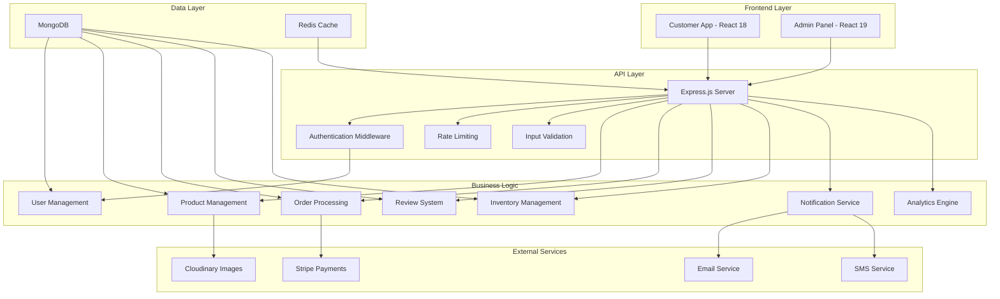

# Design Document

## Overview

This design document outlines the technical approach for enhancing the existing e-commerce platform. The improvements focus on fixing critical bugs, adding missing core features, and creating a production-ready system with proper security, user experience, and business functionality.

The design maintains the existing architecture (React frontend, Node.js backend, MongoDB) while extending it with new models, APIs, and components to support the enhanced functionality.

## Architecture

### High-Level Architecture



### Database Schema Extensions

The existing MongoDB schema will be extended with new collections and fields:

#### Enhanced User Model
```javascript
{
  _id: ObjectId,
  name: String,
  email: String (unique),
  password: String (hashed),
  cartData: Object,
  wishlist: [ObjectId], // New: references to products
  profile: {
    phone: String,
    dateOfBirth: Date,
    gender: String,
    preferences: Object
  },
  addresses: [{
    type: String, // 'shipping', 'billing'
    street: String,
    city: String,
    state: String,
    zipCode: String,
    country: String,
    isDefault: Boolean
  }],
  emailPreferences: {
    marketing: Boolean,
    orderUpdates: Boolean,
    promotions: Boolean
  },
  createdAt: Date,
  updatedAt: Date,
  lastLogin: Date
}
```

#### New Review Model
```javascript
{
  _id: ObjectId,
  productId: ObjectId,
  userId: ObjectId,
  orderId: ObjectId, // Ensures user purchased the product
  rating: Number (1-5),
  title: String,
  comment: String,
  helpful: [ObjectId], // Users who found review helpful
  verified: Boolean, // Verified purchase
  createdAt: Date,
  updatedAt: Date
}
```

#### Enhanced Product Model
```javascript
{
  _id: ObjectId,
  name: String,
  description: String,
  price: Number,
  images: [String],
  category: String,
  subCategory: String,
  sizes: [String],
  inventory: {
    total: Number,
    available: Number,
    reserved: Number, // Items in carts but not ordered
    lowStockThreshold: Number
  },
  reviews: {
    average: Number,
    count: Number,
    distribution: {
      5: Number,
      4: Number,
      3: Number,
      2: Number,
      1: Number
    }
  },
  seo: {
    metaTitle: String,
    metaDescription: String,
    keywords: [String]
  },
  bestseller: Boolean,
  featured: Boolean,
  status: String, // 'active', 'inactive', 'out_of_stock'
  createdAt: Date,
  updatedAt: Date
}
```

#### New Coupon Model
```javascript
{
  _id: ObjectId,
  code: String (unique),
  type: String, // 'percentage', 'fixed'
  value: Number,
  description: String,
  minOrderAmount: Number,
  maxDiscount: Number, // For percentage coupons
  usageLimit: Number,
  usedCount: Number,
  validFrom: Date,
  validUntil: Date,
  applicableCategories: [String],
  applicableProducts: [ObjectId],
  isActive: Boolean,
  createdBy: ObjectId,
  createdAt: Date
}
```

#### Enhanced Order Model
```javascript
{
  _id: ObjectId,
  userId: ObjectId,
  orderNumber: String, // Human-readable order number
  items: [{
    productId: ObjectId,
    name: String,
    price: Number,
    quantity: Number,
    size: String,
    image: String
  }],
  subtotal: Number,
  discount: {
    couponCode: String,
    amount: Number
  },
  shipping: {
    cost: Number,
    method: String,
    address: Object,
    trackingNumber: String,
    carrier: String
  },
  tax: Number,
  total: Number,
  status: String, // 'pending', 'confirmed', 'processing', 'shipped', 'delivered', 'cancelled'
  statusHistory: [{
    status: String,
    timestamp: Date,
    note: String
  }],
  paymentMethod: String,
  paymentStatus: String, // 'pending', 'paid', 'failed', 'refunded'
  paymentDetails: {
    stripeSessionId: String,
    transactionId: String
  },
  estimatedDelivery: Date,
  actualDelivery: Date,
  createdAt: Date,
  updatedAt: Date
}
```

#### New Analytics Model
```javascript
{
  _id: ObjectId,
  type: String, // 'daily', 'weekly', 'monthly'
  date: Date,
  metrics: {
    sales: {
      total: Number,
      count: Number,
      average: Number
    },
    products: {
      topSelling: [{ productId: ObjectId, quantity: Number }],
      lowStock: [ObjectId]
    },
    customers: {
      new: Number,
      returning: Number,
      total: Number
    },
    traffic: {
      pageViews: Number,
      uniqueVisitors: Number,
      conversionRate: Number
    }
  },
  createdAt: Date
}
```

## Components and Interfaces

### Frontend Components (Customer App)

#### New Components
1. **UserProfile Component**
   - Profile information display and editing
   - Password change functionality
   - Address management
   - Email preferences

2. **ProductReviews Component**
   - Review display with ratings
   - Review submission form
   - Review filtering and sorting
   - Helpful votes functionality

3. **Wishlist Component**
   - Wishlist item display
   - Add/remove from wishlist
   - Move to cart functionality
   - Price change notifications

4. **AdvancedSearch Component**
   - Search input with autocomplete
   - Filter sidebar with multiple options
   - Sort dropdown
   - Search results with highlighting

5. **OrderTracking Component**
   - Order status timeline
   - Tracking information display
   - Estimated delivery dates
   - Status update notifications

6. **CouponInput Component**
   - Coupon code input field
   - Validation and application
   - Discount display
   - Error handling

#### Enhanced Existing Components
1. **ProductItem Component**
   - Add wishlist button
   - Stock status indicator
   - Review rating display
   - Quick view functionality

2. **Cart Component**
   - Coupon application section
   - Stock validation
   - Improved quantity controls
   - Save for later option

### Backend API Endpoints

#### User Management APIs
```
POST   /api/user/profile/update     - Update user profile
GET    /api/user/profile           - Get user profile
POST   /api/user/change-password   - Change password
POST   /api/user/addresses         - Manage addresses
GET    /api/user/wishlist          - Get wishlist
POST   /api/user/wishlist/add      - Add to wishlist
DELETE /api/user/wishlist/remove   - Remove from wishlist
```

#### Review System APIs
```
GET    /api/reviews/product/:id    - Get product reviews
POST   /api/reviews/create         - Create review
PUT    /api/reviews/:id/helpful    - Mark review helpful
GET    /api/reviews/user           - Get user's reviews
```

#### Inventory Management APIs
```
GET    /api/inventory/check/:id    - Check product stock
POST   /api/inventory/reserve      - Reserve stock for cart
POST   /api/inventory/release      - Release reserved stock
PUT    /api/inventory/update       - Update stock levels (admin)
GET    /api/inventory/low-stock    - Get low stock products (admin)
```

#### Coupon System APIs
```
GET    /api/coupons/validate/:code - Validate coupon code
POST   /api/coupons/create         - Create coupon (admin)
GET    /api/coupons/list           - List coupons (admin)
PUT    /api/coupons/:id/toggle     - Toggle coupon status (admin)
```

#### Analytics APIs
```
GET    /api/analytics/dashboard    - Get dashboard metrics (admin)
GET    /api/analytics/sales        - Get sales analytics (admin)
GET    /api/analytics/products     - Get product analytics (admin)
GET    /api/analytics/customers    - Get customer analytics (admin)
```

#### Enhanced Search APIs
```
GET    /api/search/products        - Advanced product search
GET    /api/search/suggestions     - Search suggestions
GET    /api/search/filters         - Available filter options
```

## Data Models

### Service Layer Architecture

#### UserService
- Profile management operations
- Address CRUD operations
- Wishlist management
- Authentication enhancements

#### ProductService
- Enhanced product queries with filters
- Stock management
- Review aggregation
- Search functionality

#### ReviewService
- Review CRUD operations
- Rating calculations
- Review validation
- Helpful vote management

#### OrderService
- Enhanced order processing
- Status tracking
- Notification triggers
- Analytics data collection

#### CouponService
- Coupon validation logic
- Discount calculations
- Usage tracking
- Expiration management

#### NotificationService
- Email template management
- SMS notifications
- Push notifications
- Notification preferences

#### AnalyticsService
- Data aggregation
- Report generation
- Metric calculations
- Dashboard data preparation

## Error Handling

### Standardized Error Response Format
```javascript
{
  success: false,
  error: {
    code: 'ERROR_CODE',
    message: 'Human readable message',
    details: {}, // Additional error context
    timestamp: '2024-01-01T00:00:00Z'
  }
}
```

### Error Categories
1. **Validation Errors** (400)
   - Invalid input data
   - Missing required fields
   - Format violations

2. **Authentication Errors** (401)
   - Invalid credentials
   - Expired tokens
   - Missing authentication

3. **Authorization Errors** (403)
   - Insufficient permissions
   - Resource access denied

4. **Not Found Errors** (404)
   - Resource not found
   - Invalid endpoints

5. **Business Logic Errors** (422)
   - Out of stock
   - Invalid coupon
   - Order processing failures

6. **Server Errors** (500)
   - Database connection issues
   - External service failures
   - Unexpected errors

### Error Handling Middleware
```javascript
const errorHandler = (err, req, res, next) => {
  const statusCode = err.statusCode || 500;
  const errorResponse = {
    success: false,
    error: {
      code: err.code || 'INTERNAL_ERROR',
      message: err.message || 'Internal server error',
      details: err.details || {},
      timestamp: new Date().toISOString()
    }
  };
  
  // Log error for monitoring
  logger.error(err);
  
  res.status(statusCode).json(errorResponse);
};
```

## Testing Strategy

### Unit Testing
- **Backend**: Jest for controllers, services, and utilities
- **Frontend**: React Testing Library for components
- **Database**: MongoDB Memory Server for isolated tests

### Integration Testing
- API endpoint testing with Supertest
- Database integration tests
- External service mocking

### End-to-End Testing
- Cypress for critical user flows
- Payment flow testing with Stripe test mode
- Mobile responsiveness testing

### Performance Testing
- Load testing with Artillery
- Database query optimization
- API response time monitoring

### Security Testing
- Input validation testing
- Authentication flow testing
- Rate limiting verification
- SQL injection prevention (NoSQL injection)

## Security Enhancements

### Authentication & Authorization
1. **JWT Token Management**
   - Separate tokens for users and admins
   - Token refresh mechanism
   - Secure token storage

2. **Rate Limiting**
   - Login attempt limiting
   - API request rate limiting
   - IP-based restrictions

3. **Input Validation**
   - Request payload validation
   - SQL/NoSQL injection prevention
   - XSS protection

### Data Protection
1. **Encryption**
   - Password hashing with bcrypt
   - Sensitive data encryption at rest
   - HTTPS enforcement

2. **Privacy**
   - GDPR compliance features
   - Data anonymization
   - User data export/deletion

### Monitoring & Logging
1. **Security Monitoring**
   - Failed login attempt tracking
   - Suspicious activity detection
   - Security event logging

2. **Audit Trail**
   - Admin action logging
   - Order modification tracking
   - User activity monitoring

## Performance Optimizations

### Database Optimization
1. **Indexing Strategy**
   - Product search indexes
   - User lookup indexes
   - Order query optimization

2. **Query Optimization**
   - Aggregation pipeline optimization
   - Pagination implementation
   - Data denormalization where appropriate

### Caching Strategy
1. **Redis Implementation**
   - Product catalog caching
   - User session caching
   - Search result caching

2. **Frontend Caching**
   - API response caching
   - Image lazy loading
   - Component memoization

### API Optimization
1. **Response Optimization**
   - Payload size reduction
   - Compression implementation
   - Unnecessary data elimination

2. **Request Optimization**
   - Batch operations
   - Debounced search
   - Optimistic updates

## Deployment Considerations

### Environment Configuration
- Development, staging, and production environments
- Environment-specific configuration management
- Secret management with environment variables

### Monitoring & Analytics
- Application performance monitoring
- Error tracking and alerting
- Business metrics tracking

### Scalability Planning
- Horizontal scaling preparation
- Database sharding considerations
- CDN implementation for static assets

This design provides a comprehensive roadmap for transforming the existing e-commerce platform into a production-ready, feature-rich system that addresses all identified requirements while maintaining scalability and security best practices.